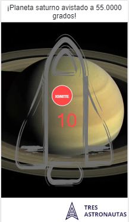

# Documentación prueba
Aplicando los conocimiento y buscando toda la documentación respecto a Nestjs y Angular se pudo finalizar satisfactoriamente la prueba. a continuación, se realizará la explicación de la solución a la que se llegó.

# Introducción
El objetivo principal era lograr llegar a una solución factible por medio de la implementación de las herramientas Nestjs y Angular.
- Para iniciar se pedía realizar un servidor en **Nestjs** el cual se encargaría de proveer un **json** para ser consumido por el Frontend el cual debía ser desarrollado con **Angular 7**
- Se Ambas aplicaciones tanto de Backend como Frontend debian estar separas a lo cual dentro del proyecto general de nombre **"/SpaceProject"** se encuentran respectivamente las carpetas del Backend desarrollado en Nestjs llamada **"/space-backend"** y la del Frontend llamada **"/spacet"**.

## Solución Backend  "space-backend"

Se ingresa inicialmente al modulo de planetas llamado  **/src/planetas** en el cual se encuentran todos aquellos archivos de configuración del servidor.
- Para el enrutamiento, Entre los archivos de configuración se encuentra el archivo **planetas.controller.ts** el cual es el controlador encargado de recibir solicitudes específicas para la aplicación.
- El archivo **planetas.module** encapsula proveedores y en el cual se puede apreciar la configuracion por defecto donde se hace referencia a `controllers:[PlanetasController], providers: [PlanetasService]`. 
- Ademas de todos los archivos anteriores también es indispensable el archivo   **planetas.service.ts** el cual en síntesis es el encargado de crear un servicio para mantener toda la lógica de la librería; para destacar, este archivo de configuracion contiene 2 métodos diferentes llamados **getPlanetas ()** y **getPlaneta ()** que son los encargados de recuperar la lista de planetas de los datos simulados y para obtener solo un planeta usando el planetaID como parámetro.
- Por ultimo pero no menos importante debemos navegar hasta el folder llamado **/src/mocks/** y en el cual se encuentra contenido el archivo **planetas.mock.ts** el cual contiene los datos del json de los planetas que posteriormente serán consumidos por el Frontend del proyecto.

## Solución Frontend del proyecto "spacet"

Para la parte del Frontend se debía trabajar con **Angular 7** en el cual cabe destacar la ubicación de los componentes con los que se debía trabajar, en el folder **/src/app** , dichos componentes son `/cabina - /fuselaje - /motor` y el servicio `planetas.service.ts`.

#### Componente `/motor`
Este componente contiene en su vista html llamada `motor.html` un botón llamado **IGNITE** que más adelante por medio de la acción click dará inicio a una cuenta regresiva.

#### Componente `/cabina`
Este componente va ser el encargado de contener la cuenta regresiva que se debe realzar según los requerimientos de la prueba y que lleva por nombre  `{{countdown}}` y la etiqueta del botón **IGNITE** que pertenece al componente `motor` y que lleva por nombre `<motor_id></motor_id>` y hace el llamado al método `(click)="startCountdownTimer()"` que será el encargado de realizar la cuenta regresiva y el cual se encuentra en el archivo `cabina.ts`.

#### Componente `fuselaje`
Este componente tiene la función de unificar los 2 componentes anteriormente mencionados, llamándolos así mediante la etiqueta `<cabina_id></cabina_id>` en la vista `cabina.html`, a demás de todo esto el objetivo de este componente es mostrar los cambios que representa ingresar unas rutas específicas en el navegador, estos cambios son el **planeta** que visitaría la nave, los **grados** y la **imagen de fondo** que representa el planeta que se desea visitar mediante la ruta proporcionada, estas son las variables representadas respectivamente y llamadas en la vista `{{planet}}, {{degrees}}` y la imagen de fondo que es invocada mediante el método `[style.backgroundImage]="getUrl()"`, sus respectivas configuraciones se encuentran en el archivo `cabina.ts`

> **Nota:** Los 3 componentes `(Control y Cabina)` antes de ser incluidos en el index se unieron en el componente `fuselaje` con la finalidad de incluir una etiqueta llamada `<fuselaje_id></fuselaje_id>` que se encuentra en  `index.html`

#### Enrutamiento
Para el enrutamiento se anexaron ademas las rutas que serian las encargadas de seleccionar el planeta que se desea visitar cumpliendo con el requerimiento que solicitaba la prueba ubicadas en el archivo de configuración `app.module.js`, aquellas reglas son: 
- `{path:'planetas',component:fuselaje}`
- `{path:'planetas/:id',component:fuselaje}])`

#### Servicio que recibe el Json de planetas
En el proyecto de angular se creo el servicio `planetas.service.tl` el cual esta encargado de realizar la petición Get que traerá los datos específicos de un planeta mediante el método `getPlanetas()` el cual recibe la ruta que se desea traer.
> **Nota:** Este método retorna un json que incluye los elementos `img y degrees`

## Anexos 
Se monstrará el proyecto guiado bajo las directrices de la prueba:

- Interfaz de inicio de la prueba

- Por medio de la busqueda en el navegador como se muestra en la imagen 

- Se puede observar como se realizan los cambios en la vista, incluyendo los datos del nombre del planeta, los grados y la imagen respectiva de dicho planeta, a continuación se muestra la imagen

- Por ultimo se quiso que la aplicación fuera responsive, así que al momento de reducir la pantalla los objetos se acomodan para ser mas armónicos en el tamaño de la pantalla.
  

##  Referencias 
A continuación, se incluirán algunas referencias adicionales que hicieron posible la realización de la prueba.

- https://vtutor.com/es/learner/my-purchased-courses/?page=course&obj=11561&lecture=11623&content_type=video
